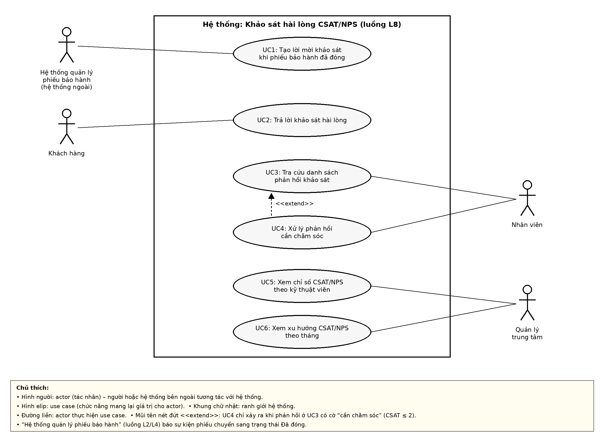

# SRS rút gọn – Khảo sát hài lòng CSAT / NPS (Luồng L8)

**Sinh viên:** Hà Gia Thiên Bảo – 2374802010032 – Track SE  
**Học phần:** Chuyên đề Tốt nghiệp 1 – HK1 2026–2027  
**Phiên bản:** 1.0 – 02/10/2026  
**Chuẩn tham chiếu:** rút gọn theo tinh thần của ISO/IEC/IEEE 29148.

## 1. Giới thiệu và phạm vi

Mekong Mobile có 6 trung tâm bảo hành, trung bình 260 yêu cầu bảo hành mỗi tháng, nhưng sau khi bảo hành xong không có kênh thu thập phản hồi; khiếu nại chỉ được biết khi khách đăng lên mạng xã hội (vấn đề V7 của case study).

**Phạm vi (một câu):** Thu thập và tổng hợp khảo sát hài lòng sau bảo hành: khi phiếu bảo hành chuyển sang trạng thái Đã đóng, hệ thống tạo một lời mời khảo sát duy nhất cho khách hàng, khách hàng chấm điểm CSAT (1–5), NPS (0–10) và để lại nhận xét, hệ thống lưu phản hồi, gắn cờ phản hồi điểm thấp và tổng hợp chỉ số hài lòng theo trung tâm, kỹ thuật viên và theo tháng trên dashboard cho quản lý.

**Chủ ý KHÔNG làm (WON'T):**

- Gửi tin nhắn SMS / Zalo / email thật cho khách (lời mời được mô phỏng bằng đường link có mã lời mời).
- Phân tích cảm xúc, chủ đề của nhận xét dạng văn bản.
- Tiếp nhận, phân loại, phân công phiếu bảo hành (thuộc luồng L2, L4 – chỉ đọc phiếu Đã đóng).
- Sửa hoặc xoá phản hồi khảo sát sau khi khách đã gửi.

**Thuật ngữ (dùng thống nhất trong SRS, sơ đồ và API):**

| Thuật ngữ | Định nghĩa | Tên kỹ thuật |
|---|---|---|
| Phiếu bảo hành | Yêu cầu bảo hành/sửa chữa có mã duy nhất (dạng BH-000123/2026), do luồng L2/L4 quản lý. | `ticket` |
| Trạng thái Đã đóng | Trạng thái cuối của phiếu bảo hành sau khi khách đã nhận lại máy. | `DA_DONG` |
| Lời mời khảo sát | Bản ghi tạo cho đúng một phiếu bảo hành Đã đóng, có mã lời mời (token) và hạn trả lời 7 ngày. | `survey_invitation` |
| Mã lời mời | Chuỗi ngẫu nhiên gắn vào đường link khảo sát, dùng để mở đúng lời mời mà không cần đăng nhập. | `token` |
| Phản hồi khảo sát | Câu trả lời của khách hàng cho một lời mời khảo sát: điểm CSAT, điểm NPS, nhận xét. | `survey_response` |
| Điểm CSAT | Mức hài lòng với lần bảo hành, thang 1–5 (1 = rất không hài lòng, 5 = rất hài lòng). | `csat_score` |
| Điểm NPS | Mức sẵn sàng giới thiệu Mekong Mobile cho người khác, thang 0–10. | `nps_score` |
| Chỉ số NPS | % khách chấm 9–10 trừ % khách chấm 0–6, giá trị từ −100 đến +100. | `nps` |
| Tỉ lệ CSAT | % phản hồi có điểm CSAT 4 hoặc 5 trên tổng phản hồi. | `csat_rate` |
| Cờ cần chăm sóc | Đánh dấu tự động cho phản hồi có điểm CSAT ≤ 2 để Nhân viên gọi lại khách. | `is_flagged` |

## 2. Các bên liên quan và vai trò người dùng

| Actor | Được làm | Không được làm |
|---|---|---|
| Khách hàng | Mở link khảo sát, chấm điểm CSAT, NPS và gửi nhận xét cho phiếu bảo hành của mình. | Không xem phản hồi của khách khác; không sửa phản hồi sau khi đã gửi. |
| Nhân viên (chăm sóc khách hàng) | Tra cứu danh sách phản hồi khảo sát, xử lý phản hồi cần chăm sóc. | Không xem số điện thoại đầy đủ (chỉ dạng che 090****567); không sửa/xoá phản hồi. |
| Quản lý trung tâm | Xem chỉ số CSAT/NPS theo kỹ thuật viên và xu hướng CSAT/NPS theo tháng của trung tâm mình; xem số điện thoại đầy đủ. | Không xem dữ liệu của trung tâm khác (QT-14). |
| Hệ thống quản lý phiếu bảo hành (hệ thống ngoài) | Báo sự kiện phiếu bảo hành chuyển sang trạng thái Đã đóng để tạo lời mời khảo sát. | Không đọc phản hồi khảo sát. |

## 3. Yêu cầu chức năng

### 3.1 Yêu cầu chức năng (FR)

| Mã | Yêu cầu chức năng |
|---|---|
| FR1 | Khi phiếu bảo hành chuyển sang trạng thái Đã đóng, hệ thống tạo đúng một lời mời khảo sát có mã lời mời duy nhất và hạn trả lời 7 ngày; không tạo lời mời cho phiếu ở trạng thái khác. |
| FR2 | Hệ thống cho phép khách hàng gửi điểm CSAT (1–5) qua link khảo sát; mỗi lời mời chỉ được trả lời một lần và chỉ trong hạn 7 ngày. |
| FR3 | Hệ thống cho phép khách hàng gửi kèm điểm NPS (0–10), không bắt buộc. |
| FR4 | Hệ thống cho phép khách hàng gửi kèm nhận xét tối đa 500 ký tự, không bắt buộc. |
| FR5 | Hệ thống cho phép Nhân viên lọc danh sách phản hồi theo trung tâm, khoảng ngày và điểm CSAT tối đa; số điện thoại hiển thị dạng che. |
| FR6 | Hệ thống tính điểm CSAT trung bình và chỉ số NPS theo từng kỹ thuật viên của trung tâm, theo tháng được chọn. |
| FR7 | Hệ thống hiển thị tỉ lệ CSAT và chỉ số NPS theo từng tháng của trung tâm mà Quản lý trung tâm phụ trách. |
| FR8 | Hệ thống tự gắn cờ cần chăm sóc cho phản hồi có CSAT ≤ 2 và cho Nhân viên đánh dấu đã gọi lại. |

### 3.2 User Story (MoSCoW)

| Mã | User Story | MoSCoW | Kiểm INVEST |
|---|---|---|---|
| US1 | Là Quản lý trung tâm, tôi muốn mỗi phiếu bảo hành vừa chuyển sang trạng thái Đã đóng được tự động tạo một lời mời khảo sát để không bỏ sót khách nào mà không phải gửi thủ công. | MUST | I: Đạt · N: Đạt · V: V7 · E: ~1 ngày · S: Đạt · T: AC1.1–1.3 |
| US2 | Là Khách hàng, tôi muốn mở link khảo sát trên điện thoại và chấm điểm CSAT 1–5 để phản ánh mức hài lòng với lần bảo hành mà không phải gọi điện hay đăng lên mạng xã hội. | MUST | I: Đạt* · N: Đạt · V: V7 · E: ~2 ngày · S: Đạt · T: AC2.1–2.4 |
| US3 | Là Khách hàng, tôi muốn chấm điểm mức sẵn sàng giới thiệu Mekong Mobile (0–10) để công ty đo được lòng trung thành của khách (NPS). | SHOULD | Đạt 6/6 (S: ~0,5 ngày) |
| US4 | Là Khách hàng, tôi muốn để lại nhận xét ngắn (tối đa 500 ký tự) để nói rõ lý do của điểm số đã chấm. | SHOULD | Đạt 6/6 (S: ~0,5 ngày) |
| US5 | Là Nhân viên, tôi muốn tra cứu danh sách phản hồi khảo sát theo trung tâm, khoảng thời gian và mức điểm CSAT để phát hiện khiếu nại sớm trước khi khách đăng lên mạng xã hội. | MUST | I: Đạt · N: Đạt · V: V7 · E: ~2 ngày · S: Đạt · T: AC5.1–5.3 |
| US6 | Là Quản lý trung tâm, tôi muốn xem điểm CSAT trung bình và chỉ số NPS theo từng kỹ thuật viên của trung tâm mình để đánh giá và cải thiện chất lượng phục vụ. | SHOULD | Đạt 6/6 (S: ~1,5 ngày) |
| US7 | Là Quản lý trung tâm, tôi muốn xem xu hướng tỉ lệ CSAT và chỉ số NPS theo tháng của trung tâm mình để biết chất lượng dịch vụ đang tốt lên hay đi xuống. | SHOULD | Đạt 6/6 (S: ~1,5 ngày) |
| US8 | Là Nhân viên, tôi muốn các phản hồi có điểm CSAT ≤ 2 được gắn cờ cần chăm sóc và đánh dấu được khi đã gọi lại để không bỏ sót khách không hài lòng trong vòng 24 giờ. | COULD | Đạt 6/6 (S: ~1 ngày) |

\* US2 cần có lời mời từ US1; khi phát triển độc lập dùng dữ liệu lời mời mẫu (seed) nên vẫn làm và kiểm thử riêng được.

### 3.3 Tiêu chí chấp nhận (Given – When – Then) cho story MUST

**US1**

- **AC1.1 (Chính)** GIVEN phiếu bảo hành BH-000123/2026 vừa chuyển sang trạng thái Đã đóng và chưa có lời mời khảo sát, WHEN hệ thống nhận sự kiện đóng phiếu, THEN hệ thống tạo đúng 1 lời mời khảo sát ở trạng thái Chờ trả lời, có mã lời mời duy nhất và hạn trả lời là 7 ngày kể từ lúc tạo.
- **AC1.2 (Ngoại lệ)** GIVEN phiếu BH-000123/2026 đã có lời mời khảo sát, WHEN sự kiện đóng phiếu được gửi lại lần thứ hai, THEN hệ thống không tạo lời mời mới (vẫn chỉ có 1 lời mời cho phiếu này) và trả về thông báo “Phiếu đã có lời mời khảo sát”.
- **AC1.3 (Ngoại lệ)** GIVEN phiếu BH-000124/2026 đang ở trạng thái Hoàn tất (khách chưa nhận máy), WHEN có yêu cầu tạo lời mời cho phiếu này, THEN hệ thống từ chối tạo lời mời và thông báo “Chỉ khảo sát phiếu ở trạng thái Đã đóng”.

**US2**

- **AC2.1 (Chính)** GIVEN lời mời khảo sát của phiếu BH-000123/2026 đang ở trạng thái Chờ trả lời và còn hạn, WHEN khách mở link, chọn điểm CSAT = 4 và bấm Gửi đánh giá, THEN hệ thống lưu phản hồi, chuyển lời mời sang Đã trả lời và hiển thị lời cảm ơn.
- **AC2.2 (Ngoại lệ)** GIVEN lời mời đã ở trạng thái Đã trả lời, WHEN khách mở lại link khảo sát, THEN hệ thống hiển thị “Bạn đã gửi đánh giá cho phiếu này” kèm điểm đã chấm và không cho gửi lại.
- **AC2.3 (Ngoại lệ)** GIVEN lời mời đã quá hạn 7 ngày và chưa được trả lời, WHEN khách mở link khảo sát, THEN hệ thống hiển thị “Link khảo sát đã hết hạn” và không cho gửi đánh giá.
- **AC2.4 (Ngoại lệ)** GIVEN khách đang ở trang khảo sát và chưa chọn điểm CSAT, WHEN khách bấm Gửi đánh giá, THEN hệ thống từ chối gửi, hiển thị “Vui lòng chọn mức hài lòng” và giữ nguyên dữ liệu đã nhập.

**US5**

- **AC5.1 (Chính)** GIVEN có 120 phản hồi trong tháng 9/2026, trong đó 7 phản hồi của trung tâm Quận 10 có CSAT ≤ 2, WHEN Nhân viên lọc trung tâm Quận 10, từ 01/09/2026 đến 30/09/2026, CSAT tối đa 2, THEN hệ thống hiển thị đúng 7 phản hồi, sắp xếp mới nhất trước, số điện thoại hiển thị dạng che 090****567.
- **AC5.2 (Ngoại lệ)** GIVEN không có phản hồi nào thỏa điều kiện lọc, WHEN Nhân viên bấm Tìm, THEN hệ thống hiển thị “Không có phản hồi phù hợp” và tổng số = 0.
- **AC5.3 (Ngoại lệ)** GIVEN Nhân viên nhập ngày bắt đầu 30/09/2026 và ngày kết thúc 01/09/2026, WHEN Nhân viên bấm Tìm, THEN hệ thống không thực hiện tìm và báo “Ngày bắt đầu phải nhỏ hơn hoặc bằng ngày kết thúc”.

### 3.4 Use Case

Sơ đồ: `docs/diagrams/usecase-l8.drawio` (file gốc) và `docs/diagrams/usecase-l8.png`.

| Mã | Use case | Actor | User Story |
|---|---|---|---|
| UC1 | Tạo lời mời khảo sát khi phiếu bảo hành đã đóng | Hệ thống quản lý phiếu bảo hành | US1 |
| UC2 | Trả lời khảo sát hài lòng | Khách hàng | US2, US3, US4 |
| UC3 | Tra cứu danh sách phản hồi khảo sát | Nhân viên | US5 |
| UC4 | Xử lý phản hồi cần chăm sóc (<<extend>> UC3) | Nhân viên | US8 |
| UC5 | Xem chỉ số CSAT/NPS theo kỹ thuật viên | Quản lý trung tâm | US6 |
| UC6 | Xem xu hướng CSAT/NPS theo tháng | Quản lý trung tâm | US7 |

**Đặc tả chi tiết UC2 – Trả lời khảo sát hài lòng**

| Mục | Nội dung |
|---|---|
| Use Case Name | Trả lời khảo sát hài lòng (UC2) |
| Actor(s) | Khách hàng |
| Summary Description | Cho phép khách hàng chấm điểm hài lòng (CSAT), điểm sẵn sàng giới thiệu (NPS) và để lại nhận xét cho một phiếu bảo hành đã đóng, thông qua link khảo sát có mã lời mời. |
| Priority | Must Have (Phải có) |
| Status | Mức độ chi tiết Cao (High Level of details) |
| Pre-Condition | · Phiếu bảo hành ở trạng thái Đã đóng. · Lời mời khảo sát của phiếu đã được tạo (UC1) và đang ở trạng thái Chờ trả lời. · Khách hàng có link khảo sát chứa mã lời mời. |
| Post-Condition(s) | · Một phản hồi khảo sát được lưu với điểm CSAT, điểm NPS (nếu có), nhận xét (nếu có) và thời điểm gửi. · Lời mời khảo sát chuyển sang trạng thái Đã trả lời. · Nếu điểm CSAT ≤ 2, phản hồi được gắn cờ cần chăm sóc. |
| Basic Path | 1. Khách hàng mở link khảo sát. 2. Hệ thống kiểm tra mã lời mời và hiển thị trang khảo sát: tên trung tâm, mã phiếu, thiết bị, ngày đóng phiếu. 3. Khách hàng chọn điểm CSAT từ 1 đến 5. 4. Khách hàng chọn điểm NPS từ 0 đến 10 (không bắt buộc). 5. Khách hàng nhập nhận xét (không bắt buộc). 6. Khách hàng bấm “Gửi đánh giá”. 7. Hệ thống kiểm tra dữ liệu, lưu phản hồi và chuyển lời mời sang Đã trả lời. 8. Hệ thống hiển thị lời cảm ơn. |
| Alternative Paths | 2a. Mã lời mời không tồn tại → hệ thống báo “Link khảo sát không hợp lệ”, kết thúc use case. 2b. Lời mời đã quá hạn 7 ngày → hệ thống báo “Link khảo sát đã hết hạn”, kết thúc use case. 2c. Lời mời đã ở trạng thái Đã trả lời → hệ thống báo “Bạn đã gửi đánh giá cho phiếu này”, hiển thị lại điểm đã chấm, không cho gửi lại. 5a. Nhận xét dài hơn 500 ký tự → hệ thống báo số ký tự vượt quá và không cho gửi đến khi sửa. 6a. Khách hàng chưa chọn điểm CSAT → hệ thống từ chối gửi, báo “Vui lòng chọn mức hài lòng”, giữ nguyên dữ liệu đã nhập, quay lại bước 3. 7a. Mất kết nối khi đang gửi → giữ dữ liệu trên trang, cho phép gửi lại; hệ thống không tạo phản hồi thứ hai cho cùng một lời mời. |
| Business Rules | B1: Chỉ khảo sát phiếu ở trạng thái Đã đóng, mỗi phiếu chỉ khảo sát một lần (QT-10). B2: Lời mời có hạn trả lời 7 ngày kể từ lúc tạo. B3: Điểm CSAT bắt buộc, số nguyên 1–5; điểm NPS không bắt buộc, số nguyên 0–10; nhận xét không bắt buộc, tối đa 500 ký tự. B4: Phản hồi đã gửi không được sửa hoặc xoá (QT-13). B5: Phản hồi có điểm CSAT ≤ 2 được gắn cờ cần chăm sóc. |
| Non-Functional Requirements | NF1: Trang khảo sát tải xong trong ≤ 2 giây trên mạng 4G (NFR1). NF2: Hiển thị đúng, không cuộn ngang trên màn hình rộng 360 px (NFR3). NF3: Khách hàng hoàn thành khảo sát trong ≤ 60 giây (NFR3). NF4: Mã lời mời ngẫu nhiên dài ≥ 32 ký tự, không đoán được (NFR4). |
| Relationship | Truy vết: US2, US3, US4 · FR2, FR3, FR4 · Bắt đầu sau UC1. |

## 4. Yêu cầu phi chức năng

| Mã | Loại | Yêu cầu (có ngưỡng đo) |
|---|---|---|
| NFR1 | Hiệu năng | Trang khảo sát tải xong trong ≤ 2 giây trên mạng 4G; API gửi phản hồi trả kết quả trong ≤ 500 ms khi CSDL có 10.000 phản hồi. |
| NFR2 | Hiệu năng | Danh sách phản hồi (trang 20 dòng) và dashboard tổng hợp hiển thị trong ≤ 3 giây với 7.800 phiếu bảo hành và 10.000 phản hồi. |
| NFR3 | Khả dụng | Khách hàng hoàn thành khảo sát trong ≤ 60 giây với tối đa 3 câu hỏi; trang khảo sát hiển thị đúng, không cuộn ngang trên màn hình rộng 360 px. |
| NFR4 | Bảo mật | Mã lời mời là chuỗi ngẫu nhiên ≥ 32 ký tự; số điện thoại khách hiển thị dạng che (090****567) với mọi vai trò trừ Quản lý trung tâm (QT-15). |
| NFR5 | Tin cậy | 0 lời mời trùng cho cùng một phiếu và 0 phản hồi trùng cho cùng một lời mời, kể cả khi sự kiện hoặc yêu cầu gửi bị lặp lại. |

## 5. Ràng buộc và quy tắc nghiệp vụ

| Mã | Quy tắc |
|---|---|
| QT-10 | Chỉ gửi khảo sát cho phiếu ở trạng thái Đã đóng, mỗi phiếu chỉ khảo sát một lần. |
| QT-13 | Không xoá vật lý phiếu bảo hành, hồ sơ khách hàng, lời mời và phản hồi khảo sát; chỉ đánh dấu ngừng sử dụng. |
| QT-14 | Nhân viên và Quản lý trung tâm chỉ xem dữ liệu của trung tâm mình làm việc / phụ trách. |
| QT-15 | Số điện thoại khách hiển thị dạng che (090****567) với mọi vai trò trừ Quản lý trung tâm. |
| BR-L8-01 | Lời mời khảo sát hết hạn sau 7 ngày kể từ lúc tạo; lời mời hết hạn không nhận phản hồi. |
| BR-L8-02 | Điểm CSAT bắt buộc, số nguyên 1–5; điểm NPS không bắt buộc, số nguyên 0–10; nhận xét không bắt buộc, tối đa 500 ký tự. |
| BR-L8-03 | Chỉ số NPS = % điểm NPS 9–10 trừ % điểm NPS 0–6 (chỉ tính phản hồi có điểm NPS); tỉ lệ CSAT = % phản hồi có CSAT 4–5. |
| BR-L8-04 | Phản hồi có điểm CSAT ≤ 2 được gắn cờ cần chăm sóc ngay khi lưu. |
| BR-L8-05 | Phản hồi đã gửi không được sửa hoặc xoá. |

Ràng buộc dự án: hiện thực trong 6 buổi thực hành (BT2); dữ liệu dùng bộ mẫu case study (`tickets_history.csv`, `survey_responses.csv`, `technicians.csv`, `service_centers.csv`) và dữ liệu sinh mô phỏng với seed 42.

## 6. Bảng truy vết yêu cầu

| Mã FR | Yêu cầu chức năng | User Story | Use Case | MoSCoW | Test case (BT3) |
|---|---|---|---|---|---|
| FR1 | Khi phiếu bảo hành chuyển sang trạng thái Đã đóng, hệ thống tạo đúng một lời mời khảo sát có mã lời mời duy nhất và hạn trả lời 7 ngày; không tạo lời mời cho phiếu ở trạng thái khác. | US1 | UC1 | MUST | TC01–TC03 |
| FR2 | Hệ thống cho phép khách hàng gửi điểm CSAT (1–5) qua link khảo sát; mỗi lời mời chỉ được trả lời một lần và chỉ trong hạn 7 ngày. | US2 | UC2 | MUST | TC04–TC08 |
| FR3 | Hệ thống cho phép khách hàng gửi kèm điểm NPS (0–10), không bắt buộc. | US3 | UC2 | SHOULD | TC09 |
| FR4 | Hệ thống cho phép khách hàng gửi kèm nhận xét tối đa 500 ký tự, không bắt buộc. | US4 | UC2 | SHOULD | TC10 |
| FR5 | Hệ thống cho phép Nhân viên lọc danh sách phản hồi theo trung tâm, khoảng ngày và điểm CSAT tối đa; số điện thoại hiển thị dạng che. | US5 | UC3 | MUST | TC11–TC13 |
| FR6 | Hệ thống tính điểm CSAT trung bình và chỉ số NPS theo từng kỹ thuật viên của trung tâm, theo tháng được chọn. | US6 | UC5 | SHOULD | TC14 |
| FR7 | Hệ thống hiển thị tỉ lệ CSAT và chỉ số NPS theo từng tháng của trung tâm mà Quản lý trung tâm phụ trách. | US7 | UC6 | SHOULD | TC15 |
| FR8 | Hệ thống tự gắn cờ cần chăm sóc cho phản hồi có CSAT ≤ 2 và cho Nhân viên đánh dấu đã gọi lại. | US8 | UC4 | COULD | — (không hiện thực ở BT2) |

Đặc tả riêng track SE: xem [api-contract.md](api-contract.md).
